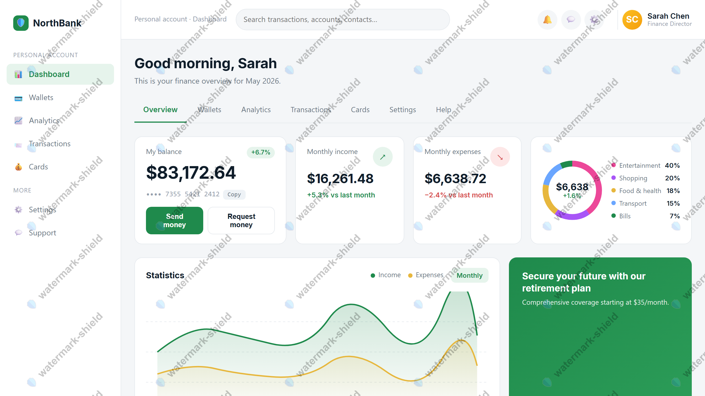
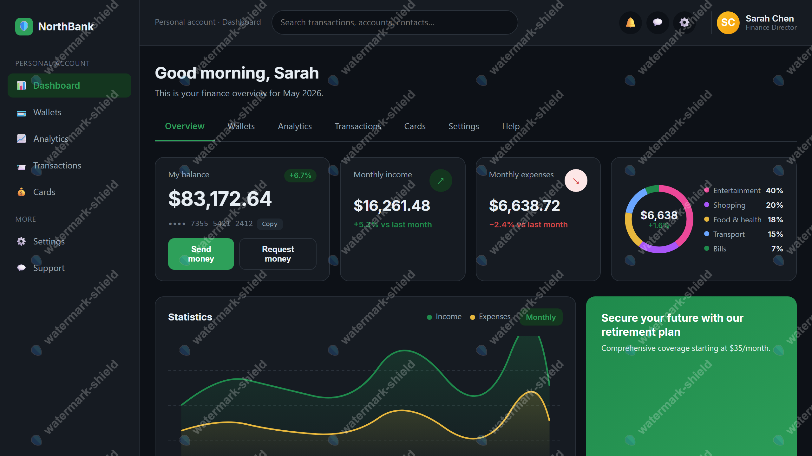

# 🛡️ watermark-shield

> **Stop casual screenshot leaks. Identify the leaker when one happens anyway.**

A browser watermarking library that stamps the user's identity across the page and resists the common ways people try to remove it (DevTools, CSS overrides, DOM removal).

Supports Vanilla TS / JS, Angular, React, and Vue 3.

<p>
  
  
  
  
</p>

<p>
  <a href="https://www.npmjs.com/package/watermark-shield"></a>
  <a href="https://github.com/mhwazrah/watermark-shield/commits/main"></a>
  <a href="https://github.com/mhwazrah/watermark-shield/stargazers"></a>
  <a href="./LICENSE"></a>
  
</p>

---

## 🤔 Why?

You have a screen full of private data: customer personally identifiable information, financial reports, healthcare records, internal dashboards, government secrets, anything that lives behind an NDA.

Anyone who can see it can capture it. You can't stop the capture, but you can make sure that any captured image (screenshot, phone-camera photo, screen-recording, print-to-PDF) carries the leaker's name tiled across the frame.

---

<p align="center">
  
</p>
<p align="center">
  
</p>
<p align="center"><sub>Light and dark modes. Colour switches automatically with <code>prefers-color-scheme</code>.</sub></p>

---

## ✨ Features

- DevTools guard with configurable redirect URL.
- Server-side audit hook (`onDevtoolOpen`) so events are recorded even when client defenses are bypassed.
- Optional aggressive `debugger;` trap for high-risk pages.
- Auto-sized tiles based on text width and rotation.
- Theme-aware text colour: pass `{ light, dark }` and the watermark switches with `prefers-color-scheme`.
- Framework-agnostic core, with Angular, React, and Vue 3 bindings via sub-path imports.
- About 6 KB gzipped, plus a separate 6 KB lazy chunk for the DevTools guard.
- SSR-safe and CSP-friendly (no `eval`).
- Renders above iframes and Shadow DOM, supports RTL scripts.
- TypeScript strict-mode safe.

---

## 📚 Compatibility

| Runtime / framework | Supported versions |
|---|---|
| **Browsers** | Modern evergreen: Chrome / Edge 100+, Firefox 100+, Safari 15.4+ |
| **TypeScript** | 5.5+ |
| **Angular** | 18, 19, 20, 21 |
| **React** | 18, 19 |
| **Vue** | 3.0+ |
| **Node** | 20+ |

---

## 🚀 Quick start

`watermark-shield` ships with a framework-agnostic core plus bindings for **Angular**, **React**, and **Vue 3**. Each framework has its own sub-path entry, so you only pay the cost of the one you use.

| Framework | Import from | Binding |
|---|---|---|
| Vanilla TS / JS | `watermark-shield` | `WatermarkShield` class |
| Angular | `watermark-shield/angular` | `WatermarkShieldService`, `[wmShield]` directive |
| React | `watermark-shield/react` | `useWatermarkShield` hook |
| Vue 3 | `watermark-shield/vue` | `useWatermarkShield` composable |

### Vanilla TS / JS

```ts
import { WatermarkShield } from 'watermark-shield';

const shield = new WatermarkShield({
  content: user.id,                       // 'usr_a1b2c3'
  spaceBetween: 80,                       // density. smaller = denser
  fontColor: { light: '#000', dark: '#fff' },
  protect: { devtool: true },
});

shield.create();

// later:
shield.update({ content: user.id });
shield.destroy();
```

### Angular service injection

```ts
import { AfterViewInit, Component, OnDestroy, inject } from '@angular/core';
import { WatermarkShieldService } from 'watermark-shield/angular';

@Component({ /* ... */ })
export class AppComponent implements AfterViewInit, OnDestroy {
  private readonly shield = inject(WatermarkShieldService);

  ngAfterViewInit() {
    this.shield.create({
      content: user.id,
      fontColor: { light: '#000', dark: '#fff' },
      protect: { devtool: true },
    });
  }

  ngOnDestroy() { this.shield.destroy(); }
}
```

### Angular directive

```ts
import { Component } from '@angular/core';
import { WatermarkShieldDirective } from 'watermark-shield/angular';

@Component({
  imports: [WatermarkShieldDirective],
  template: `
    <main [wmShield]="{ content: user.id, protect: { devtool: true } }">
      <!-- sensitive content -->
    </main>
  `,
})
export class DashboardComponent {}
```

### React `useWatermarkShield` hook

```tsx
import { useWatermarkShield } from 'watermark-shield/react';
import { useAuth } from './auth';

export function App() {
  const { user } = useAuth();

  // Call once from your root component.
  useWatermarkShield({
    content: user.id,
    fontColor: { light: '#000', dark: '#fff' },
    protect: { devtool: true },
  });

  return <Routes>{/* ... */}</Routes>;
}
```

To swap the displayed identity (e.g. user switches accounts), keep a handle to the hook's return value and call `update`:

```tsx
const shield = useWatermarkShield({ content: user.id });

useEffect(() => {
  shield.update({ content: user.id });
}, [user.id, shield]);
```

### Vue 3 `useWatermarkShield` composable

```vue
<script setup lang="ts">
import { useWatermarkShield } from 'watermark-shield/vue';
import { useAuth } from './auth';

const { user } = useAuth();

// Call once from your root component.
useWatermarkShield({
  content: user.value.id,
  fontColor: { light: '#000', dark: '#fff' },
  protect: { devtool: true },
});
</script>

<template>
  <RouterView />
</template>
```

To swap the displayed identity (e.g. user switches accounts), hold onto the handle and call `update`:

```ts
const shield = useWatermarkShield({ content: user.value.id });

watch(() => user.value.id, (next) => {
  shield.update({ content: next });
});
```

> Every binding exposes the same lifecycle: **`create` → `update` → `destroy`**. Pick the one that matches your framework.

---

## ⚙️ Options reference

### `WatermarkShieldOptions`

| Property | Type | Default | Recommended | Description & purpose |
|---|---|---|---|---|
| `content` | `string` | *required* | An attributable identifier (email > userId > username) | **What:** the text rendered tiled across the screen. **Why:** when a screenshot leaks, `content` is what tells you who took it. Pick something that uniquely identifies one user. `user.id` is a good default. |
| `spaceBetween` | `number` | `80` | `60`–`100` | **What:** gap in CSS pixels between repeating tiles. **Why:** the only knob you need for density. Smaller value → denser watermark → harder for an attacker to crop a clean corner of the screenshot, but more visual noise for legitimate users. Larger value → sparser → less obtrusive but easier to crop. The default 80 is a balanced middle ground; 40–60 for high-stakes screens, 120+ for casual dashboards. |
| `fontSize` | `number \| string` | `16` | `14`–`18` | **What:** watermark font size in pixels. Accepts a number (`18`) or a CSS length string (`'18px'`). **Why:** drives how readable the watermark is in a leaked image. Too small (under 10px) and screenshot compression can blur it into illegibility; too large (over 24px) and it dominates the UI. Stay in the 14–18 range for production. |
| `fontFamily` | `string` | `'sans-serif'` | `'sans-serif'` | **What:** font used to render the watermark text. **Why:** stick with system fonts so you don't pay a font-load cost or break if a custom font fails to load. The watermark is functional, not decorative. Readability beats branding here. |
| `fontWeight` | `string` | `'normal'` | `'normal'` or `'bold'` | **What:** CSS font-weight. **Why:** `'bold'` makes the watermark slightly more visible after JPEG compression, at the cost of marginally more visual noise on the live UI. Use `'bold'` if your screenshots tend to come back compressed (Slack, WhatsApp, social media). |
| `fontColor` | `string \| { light: string; dark: string }` | `'#000'` | `{ light: '#000', dark: '#fff' }` | **What:** watermark text colour. Either a single CSS colour, or a `{ light, dark }` pair. **Why:** use the pair form. Black text disappears on a dark UI; white text disappears on a light UI. The shield watches `prefers-color-scheme` and re-renders the watermark in the right colour automatically when the user toggles their OS theme, so the watermark stays attributable across both modes. |
| `globalAlpha` | `number` | `0.5` | `0.14`–`0.20` | **What:** canvas-level alpha from 0 (invisible) to 1 (fully opaque). **Why:** the library default of 0.5 is way too dark for production UI; it overpowers content. The sweet spot for screen-attribution is 0.14–0.20: faint enough to not distract live users, dark enough to survive JPEG compression and photo-of-screen capture. Below 0.10 the watermark fades to nothing on lossy compression. |
| `rotate` | `number` | `-22` | `-22` | **What:** tile rotation angle in degrees. **Why:** a slight diagonal makes the watermark much harder to crop out than horizontal text. Vertical strips of watermark-free pixels are bigger when text runs straight; the diagonal forces every reasonably-sized crop to include several full instances of the text. The default -22° is fine. |
| `parent` | `HTMLElement \| string` | `document.body` | `document.body` | **What:** where the watermark mounts. Pass an element or a CSS selector string. **Why:** use the default unless you specifically want a *scoped* watermark on one panel of the app rather than full-viewport. Note that scoped watermarks lose their full-screen guarantee and are easier to crop out. Only use this if a global watermark would conflict with your UI for some reason. |
| `protect` | `ShieldProtections` | *(see next table)* | *(see next table)* | **What:** the configurable hardening features. **Why:** the watermark itself is just pixels. `protect` is what makes those pixels survive when the user opens DevTools. See the table below for individual settings. |

> Every option supported by the underlying watermark engine (`watermark-js-plus`) is also available. See its docs for the full list.

### `ShieldProtections`

| Property | Type | Default | Recommended | Description & purpose |
|---|---|---|---|---|
| `devtool` | `boolean` | `false` | `true` *in prod*, `false` *in dev* | **What:** turns on the DevTools-detection guard. When DevTools opens, the page redirects to `devtoolUrl` (firing `onDevtoolOpen` first). **Why:** screenshot attribution only works while the watermark is on the screen; DevTools is the most common way casual users try to remove it. **Always `false` in development** so your engineers can debug their own app; gate this on `import.meta.env.PROD` (Vite) or `environment.production` (Angular). |
| `disableMenu` | `boolean` | `false` | `false` | **What:** if `true`, also disables the browser's right-click context menu while DevTools detection is active. **Why:** **leave at `false`.** Legitimate users need the right-click menu for Copy, Translate, Inspect Image, accessibility tools, dictionary lookup, etc. Disabling it is hostile UX and gives almost no security benefit. The menu doesn't expose any leak vectors that DevTools detection doesn't already cover. |
| `devtoolUrl` | `string` | *(internal default)* | A page you control | **What:** URL the user is redirected to when DevTools opens. **Why:** the library's default is a localhost placeholder that looks broken to end users. Point this at a friendly page on your domain (e.g. `/security/devtool-blocked`) that explains why the user landed there and how to contact support. This is the message your most-curious users will see. |
| `onDevtoolOpen` | `(detectorType: number) => void` | `undefined` | A `sendBeacon` to your audit-log endpoint | **What:** a callback fired when DevTools is detected, *before* the redirect. |
| `debuggerLoop` | `boolean` | `false` | `false` *(or `true` only on narrow high-risk pages)* | **What:** activates an aggressive anti-tamper trap that pauses execution on a `debugger;` statement when DevTools is open. **Why: leave at `false` by default.** It's hostile UX. It punishes any user who happens to have DevTools open for legitimate reasons (extensions, accessibility tools, screen readers in some configurations). Only consider `true` for explicitly high-risk pages where the friction is acceptable, and warn affected users. |

---

## 🏭 Best practices for production

```ts
shield.create({
  // Identity
  content: user.id,                      // attributable identifier
  globalAlpha: 0.16,                     // faint enough not to distract, dark enough to survive screenshot compression

  // Theme-aware text colour
  fontColor: {
    light: '#000000',                    // black on light UI
    dark:  '#ffffff',                    // white on dark UI
  },                                     // shield switches automatically on theme change

  // Tile density (tile size is auto-computed)
  spaceBetween: 80,                      // gap in px between repeating tiles
  fontSize: 16,
  rotate: -22,                           // slight diagonal, harder to crop out

  protect: {
    // Active deterrents (production only)
    devtool: true,                       // ✅ turn ON in production
    disableMenu: false,                  // ⚠️ KEEP at false; don't break right-click for legitimate users
    devtoolUrl: 'https://yourapp.com/security/devtool-blocked',

    // Audit logging
    onDevtoolOpen: (detectorType) => {
      // The page is about to redirect. Fire-and-forget.
      // No userId in the body. Your server resolves it from the session cookie.
      navigator.sendBeacon(
        '/api/audit/devtool',
        new Blob(
          [JSON.stringify({
            detectorType,
            url: location.href,
            referrer: document.referrer || null,
            ts: Date.now(),
          })],
          { type: 'application/json' },
        ),
      );
    },

    // Hostile-UX trap (opt-in for high-risk pages)
    debuggerLoop: false,                 // ❌ leave OFF unless you've decided the friction is acceptable
  },
});
```

> **Why each setting?** See the [Options reference](#%EF%B8%8F-options-reference) above. Every option has its recommended production value and the reasoning right next to its type and default.

### Lifecycle pattern

| When | What to do |
|---|---|
| **App boot / route entry** | `shield.create()` with the current user's identity |
| **Login / user switch** | `shield.update({ content: newUserId })` |
| **Logout / route exit** | `shield.destroy()` |

### Gating tips

- **Disable in development.** Gate `devtool: true` on `import.meta.env.PROD` (Vite) or `environment.production` (Angular). Otherwise your engineers can't debug their own app.
- **Whitelist staff & QA.** For sessions that should bypass the watermark entirely (support engineers, QA, automated end-to-end tests), **don't call `shield.create()` at all** for that user. Setting `protect: undefined` does *not* disable the shield. It just falls back to defaults; the only true bypass is "skip creation."
- **Content Security Policy.** The shield injects a `<style>` element to enforce the watermark's opacity, and the watermark image is rendered as a `data:` URI in the overlay's `background-image`. If you have a strict CSP, allow:
  - `style-src 'self' 'unsafe-inline'` *(or a nonce-based equivalent if your CSP issues nonces)*
  - `img-src 'self' data:` *(for the canvas-rendered watermark PNG)*
  - `connect-src` must include your `onDevtoolOpen` audit endpoint origin if it's cross-origin

---

## 🚨 Wiring DevTools detection end-to-end

### The audit endpoint (`onDevtoolOpen`)

`onDevtoolOpen` fires *immediately before* the redirect. POST the event to your server. The frontend body **does not include `userId`**: the server resolves the user from the session cookie or JWT in the `Authorization` header. Never trust client-supplied identity for an audit log.

#### Endpoint contract

`POST /api/audit/devtool`

**Authentication:** session cookie or `Authorization: Bearer <jwt>`. The server resolves the user id from the cookie or JWT, not from the body.

**Request body (`application/json`):**

| Field | Type | Description |
|---|---|---|
| `detectorType` | `number` | Which detection probe fired. Useful for diagnosing false positives. |
| `url` | `string` | Full page URL when DevTools opened. |
| `referrer` | `string \| null` | `document.referrer` if available. |
| `ts` | `number` | Client-side millisecond epoch (`Date.now()`). Treat as advisory; the server should also stamp its own `received_at`. |

**Responses:**

- `204` on success (`sendBeacon` ignores response bodies).
- `400` on malformed JSON.
- `429` when rate-limited. Cap to roughly 1 req/sec/IP; the legitimate frontend fires at most once per page-load.

### Operational notes

- **Trust server-side identity, not the request body.** An attacker who bypasses the redirect can also call your endpoint with a forged `userId`, which is why this contract has no `userId` field. Resolve the user from the session cookie or JWT server-side.
- **Rate-limit aggressively.** The legitimate frontend fires *at most once per page-load*. Cap the endpoint to 1 req/sec/IP and you turn an audit endpoint into a DDoS-resistant one.
- **Retention.** Keep events for at least 90 days for incident response. Compliance regimes (HIPAA, SOX, GDPR special-category) may require longer or stricter handling. Document the retention policy with your legal and security teams. `user_agent` and `ip` are PII in some jurisdictions.

---

## 🙏 Acknowledgements

- **[watermark-js-plus](https://github.com/zhensherlock/watermark-js-plus)** by [@zhensherlock](https://github.com/zhensherlock): the canvas-watermark engine that does the actual rendering. `watermark-shield` is a thin hardening layer on top of this excellent library.
- **[disable-devtool](https://github.com/theajack/disable-devtool)** by [@theajack](https://github.com/theajack): the DevTools detection layer used internally.

---

## 🤝 Contributing

PRs welcome: bug fixes, new framework wrappers (Svelte, Solid, Qwik…), docs improvements. Use [Conventional Commits](https://www.conventionalcommits.org/) and explain *what* and *why* in the PR description.

**Style:** TypeScript strict mode, named exports, `// Why:` comments for non-obvious decisions.

---

## 🐛 Issues & support

- **Bug reports:** [open an issue](https://github.com/mhwazrah/watermark-shield/issues/new) with reproduction steps and version info.
- **Feature requests:** [open an issue](https://github.com/mhwazrah/watermark-shield/issues/new) tagged `enhancement`.
- **Security disclosures:** email the maintainer directly rather than opening a public issue.
- **Questions:** [GitHub Discussions](https://github.com/mhwazrah/watermark-shield/discussions) or an issue tagged `question`.

---

## 👤 Authors

Made by **Mohammed Hassan Abo Wazrh**. Follow me on [Twitter / X](https://twitter.com/mhwdosari).

---

## 📄 License

[Apache License 2.0](./LICENSE). Copyright © 2026 Mohammed Hassan Abo Wazrh. Includes a patent grant; safe for personal, commercial, and closed-source use. See [LICENSE](./LICENSE) for the full text.
